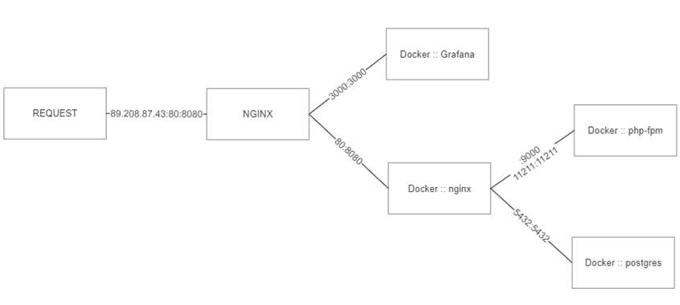
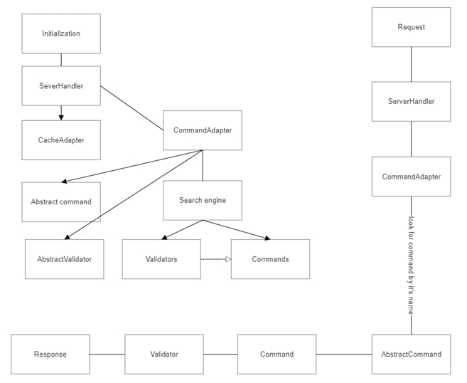
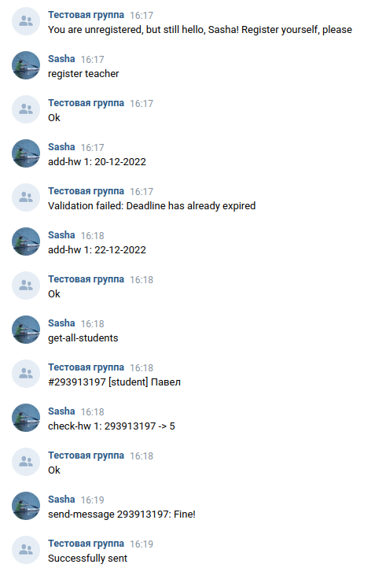
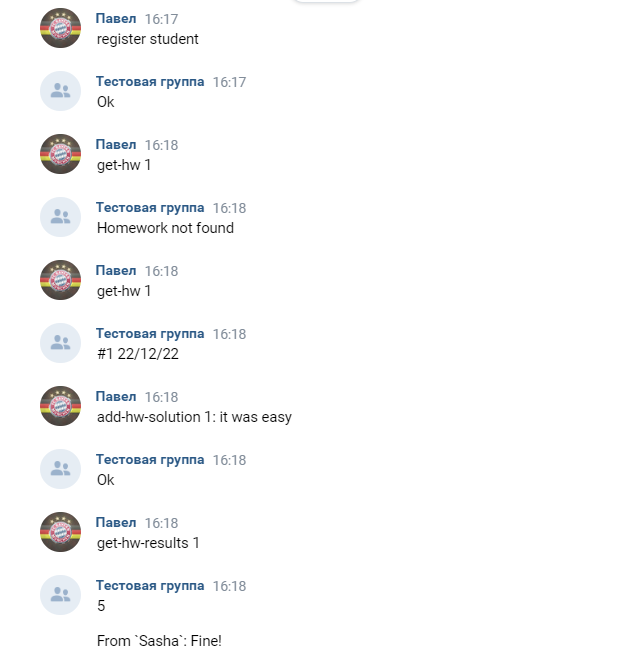

# VK-bot

---

Project of a bot in `php` for VK.
It is an educational project, that will show my skills in these type of programming.

---

Bot that will simplify studying process by simplifying teacher-student interconnection.
Now, it will become just one-click to get your homework results as long as on click for uploading it.

### Functionality

List of functions that bot provides for:

- Teacher: 
  - set new homework
  - reset deadline
  - save result
  - reply to student in message
- Student:
  - upload solution
  - check if work is checked
  - get all classmates' results

---

### Future plans:

- provide a messenger to simplify for students interaction with teachers
- add possibility to contain several courses in one session bot-student*
- add some timetable
- etc.

---

### Request and response diagrams:

#### request

#### response

---

### Usage example
|                   Teacher                   |                   Student                   |
|:-------------------------------------------:|:-------------------------------------------:|
|  |  |

---
**now it is impossible to have one instance of bot for several courses/classes.
So, for each class you should have independent bot. It is not very comfortable, so it is going to be modified*
